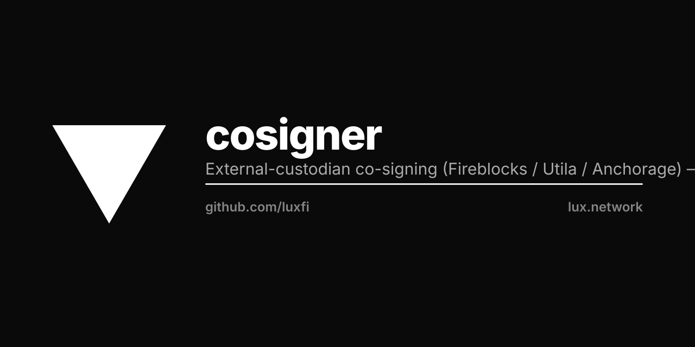

<p align="center"></p>

# luxfi/cosigner — external-custodian co-signing

`github.com/luxfi/cosigner` is the **single, vendor-neutral co-signing layer**
for external regulated custodians (Fireblocks, Utila, Anchorage). It is an
orthogonal leaf, decomplected OUT of the permissionless bridge: the bridge
(`luxfi/bridge`) depends on it, and it depends on **nothing** but the standard
library plus its own vendored `secrets` subpackage. There is exactly one
co-signing contract; custodian families are orthogonal `Kind`s behind one
`FamilyDispatcher` interface.

Layered cosigners let an institutional flow attach an external regulated
custodian on top of the native MPC threshold signature. Per swap the SDK posts
a `cosigners[]` array of **public identifiers only**; the consumer validates the
wire shape, fetches the secret half from KMS keyed by the public id, dispatches
a cosign request to each custodian after the native sign completes, and gates
the broadcast on **all listed cosigners approving**.

## Packages

| Import | Purpose |
|--------|---------|
| `github.com/luxfi/cosigner` | The contract: `Kind`, `Intent`, `Result`, `ValidateIntents`, the `Dispatcher` / `SecretStore` / `FamilyDispatcher` interfaces, `NewDefault`, and the `AllApproved` gate. One validator + one dispatch branch per `Kind`. |
| `github.com/luxfi/cosigner/secrets` | Self-contained URI-scheme secret resolver — `literal:`, `env:`, `file:`, `kms:`. Cloud SDKs register a `kms:` provider via `RegisterKMS`; the default binary drags in none. |

## Kinds (orthogonal custodian families)

- **`KindFireblocks`** — PRODUCTION. Real Fireblocks REST RAW-sign flow with
  RS256-JWT request authentication (`FireblocksRESTFamily`): create the
  transaction, poll to a terminal state, surface the signature.
- **`KindUtila`** — blocked on a Go `@luxfi/utila` Connect-RPC client / `.proto`
  source (`UtilaConnectRPCFamily`). Fails LOUD with a typed
  `*NotImplementedError` that names the missing artifact — never a silent pass.
- **`KindAnchorage`** — blocked on the Anchorage API spec / SDK
  (`AnchorageFamily`). Same fail-loud contract.

Wire them with `CompositeFamilyDispatcher` (one field per family, unset slots
fall back to `StubFamilyDispatcher`, which also fails loud).

## Secret stores

- **`KMSSecretStore`** — PRODUCTION. Resolves the secret half through the
  `secrets.Resolver`, keyed by the public identifier preserved VERBATIM
  (`<base>/fireblocks/<api_key>/secret_pem`, …). Errors name the `Kind` only.
- **`EnvSecretStore`** — dev / file-mount. Reads `…_COSIGNER_PEM__<envSafe(id)>`,
  passing the value through the same resolver so `file:` / `kms:` schemes work.

## Invariants

- **Secret material NEVER crosses the wire.** The SDK sends only public
  identifiers; `ValidateIntents` rejects any entry carrying a secret-like field
  name (`api_secret`, `private_key`, `jwt`, `token`, …) as a forwarder-bug
  backstop. The consumer fetches the secret half from KMS at dispatch time.
- **Errors name the KIND, never the secret reference.** A `SecretResolveError`
  surfaces which family failed; it never echoes the resolved URI, tenant id, or
  secret path. The resolver cause is preserved for `errors.Is` (against
  `ErrSecretNotConfigured` and `secrets.ErrKMSNotRegistered`) but never rendered.
- **Honesty invariant.** A family whose real integration is not yet available
  fails loud with `ErrNotImplemented` — never a stub dressed up as an approval.
- **All-or-nothing gate.** `AllApproved` requires every result `StatusApproved`;
  any rejection or failure blocks the swap. Empty input → no gate (the
  permissionless default is zero cosigners).

## Build

```sh
GOWORK=off go build ./...
GOWORK=off go test ./...
```
